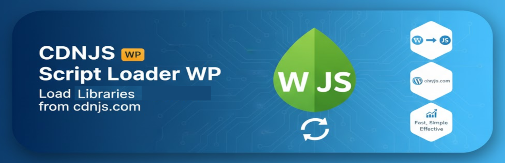

# CDNJS Script Loader


---



## Description

**CDNJS Script Loader** is a lightweight, intelligent WordPress plugin that allows you to load JavaScript libraries from [CDNJS](https://cdnjs.com) - the world's largest CDN for web libraries. Unlike bloated performance plugins, CDNJS Script Loader focuses on one thing and does it well: smart CDN management with automatic fallback.

### Why CDNJS Script Loader?

- **Lightweight**: Single-purpose plugin without unnecessary features
- **Intelligent Fallback**: Automatically falls back to local copies when CDN fails
- **Performance Monitoring**: Real-time tracking of CDN performance and reliability
- **Security First**: Automatic SRI (Subresource Integrity) hash validation
- **Dependency Safe**: Preserves WordPress script dependencies
- **Simple Interface**: Clean, intuitive admin UI with tabs

## Features

### Core Features

- ✅ **Easy Library Management**: Add JavaScript libraries from CDNJS with just name and version
- ✅ **Custom Filenames**: Support for libraries with non-standard file naming
- ✅ **SRI Hash Validation**: Automatic security through Subresource Integrity
- ✅ **Dependency Preservation**: Maintains WordPress script dependencies when replacing

### Intelligent Fallback System

- ✅ **Automatic Detection**: Detects CDN failures using JavaScript `onerror` handlers
- ✅ **Local Upload**: Upload and manage local fallback copies
- ✅ **Failure Tracking**: Monitors and logs CDN failures
- ✅ **Zero Downtime**: Seamless fallback to local copies when CDN is unreachable

### Performance Dashboard

- ✅ **Real-Time Metrics**: Track load times using Navigation Timing API
- ✅ **Failure Analytics**: Monitor failure rates and last failure timestamps
- ✅ **Status Indicators**: Visual health indicators (Good/Warning/Critical)
- ✅ **Performance History**: Average load times per library

## Installation

### From WordPress Admin

1. Download the latest release
2. Go to **Plugins > Add New > Upload Plugin**
3. Upload the `.zip` file
4. Click **Install Now** and then **Activate**

### Manual Installation

1. Download the plugin files
2. Upload to `/wp-content/plugins/cdnjs-script-loader/`
3. Activate through the WordPress **Plugins** menu

### From GitHub

```bash
cd wp-content/plugins/
git clone https://github.com/rafael-minuesa/cdnjs-script-loader.git
```

## Usage

### Basic Setup

1. Navigate to **Settings > CDNJS Script Loader**
2. Go to the **Libraries** tab
3. Add your libraries:
   - **Library Name**: e.g., `jquery`
   - **Version**: e.g., `3.7.1`
   - **Custom Filename** (optional): e.g., `jquery.min.js`
4. Click **Save Libraries**

### Setting Up Fallback

1. Go to the **Fallback** tab
2. Enable **Automatically load local copies if CDN fails**
3. Upload local copies of your libraries:
   - Select the `.js` file
   - Enter the library name (must match the name in Libraries tab)
   - Click **Upload Fallback File**

### Monitoring Performance

1. Go to the **Performance** tab
2. View real-time metrics:
   - Total loads
   - Average load time
   - Failure count and rate
   - Status indicators
3. Reset statistics if needed

## How It Works

### CDN Integration

The plugin integrates with the CDNJS API to:
- Fetch correct library URLs
- Retrieve SRI hashes for security
- Cache library data for 7 days

When the API is unavailable, it constructs URLs manually using common patterns.

### Fallback Mechanism

```javascript
// Automatically injected for each library
cdnScript.onerror = function() {
    console.warn('CDN failed, loading local fallback');
    var fallback = document.createElement('script');
    fallback.src = '/wp-content/uploads/cdnjs-fallbacks/library.min.js';
    document.head.appendChild(fallback);
};
```

### Performance Tracking

Uses the **Performance Observer API** to track:
- Resource load duration
- Transfer size
- Success/failure rates

Data is sent via `navigator.sendBeacon()` without blocking page load.

## Requirements

- **WordPress**: 5.0 or higher
- **PHP**: 7.4 or higher
- **JavaScript**: ES5+ browser support

## Frequently Asked Questions

### Does this work with any JavaScript library?

Yes, as long as the library is available on [CDNJS](https://cdnjs.com). Search for your library there first.

### What happens if CDNJS is down?

If you've uploaded a local fallback copy, it will load automatically. If not, the script will fail to load (same as if it wasn't installed).

### Does this affect page speed?

Generally, yes - in a positive way. CDNs are faster for most users, and the plugin only adds minimal JavaScript for fallback detection.

### Can I use this with WP Rocket or other caching plugins?

Yes! CDNJS Script Loader works alongside caching plugins. It runs at priority 999 to ensure compatibility.

### Is it secure to load scripts from a CDN?

Yes, when using SRI hashes (which this plugin does automatically). SRI ensures the file hasn't been tampered with.

## Changelog

### 2.0.0 - 2025-01-09

**Major Update**

- ✅ Fixed critical bug with array handling in script replacement
- ✅ Added automatic fallback to local copies on CDN failure
- ✅ Implemented SRI (Subresource Integrity) hash support
- ✅ Added CDNJS API integration with caching
- ✅ New performance monitoring dashboard
- ✅ Tabbed admin interface (Libraries/Fallback/Performance)
- ✅ Local file upload and management
- ✅ Dependency preservation when replacing scripts
- ✅ Custom filename support for non-standard libraries
- ✅ Failure tracking and analytics
- ✅ Real-time performance metrics using Performance Observer API

### 1.2 - Previous Release

- Basic CDNJS URL replacement
- Simple admin interface

## Contributing

Contributions are welcome! This is an open-source project aimed at filling a gap in the WordPress ecosystem.

### Development Setup

```bash
git clone https://github.com/rafael-minuesa/cdnjs-script-loader.git
cd cdnjs-script-loader
```

### Reporting Issues

Please report bugs and feature requests on [GitHub Issues](https://github.com/rafael-minuesa/cdnjs-script-loader/issues).

## License

This plugin is licensed under the GPL-2.0+ License. See [LICENSE](LICENSE) for details.

## Credits

- **Author**: Rafael Minuesa
- **Website**: [prowoos.com](http://prowoos.com/)
- **CDNJS**: Powered by [Cloudflare CDNJS](https://cdnjs.com)

## Support

- **Documentation**: This README
- **Issues**: [GitHub Issues](https://github.com/rafael-minuesa/cdnjs-script-loader/issues)
- **CDNJS Library Search**: [cdnjs.com](https://cdnjs.com)

---

**Made with ❤️ for the WordPress community**
