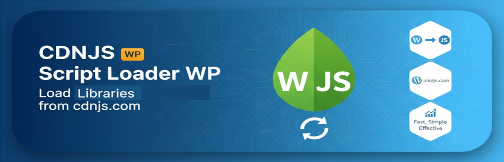

# CDNJS Script Loader


---



## Description

**CDNJS Script Loader** is a lightweight, intelligent WordPress plugin that allows you to load JavaScript libraries from [CDNJS](https://cdnjs.com) - the world's largest CDN for web libraries. Unlike bloated performance plugins, CDNJS Script Loader focuses on one thing and does it well: smart CDN management with automatic fallback.

### Why CDNJS Script Loader?

- **Lightweight**: Single-purpose plugin without unnecessary features
- **Intelligent Fallback**: Automatically falls back to local copies when CDN fails
- **Performance Monitoring**: Real-time tracking of CDN performance and reliability
- **Security First**: Automatic SRI (Subresource Integrity) hash validation
- **Dependency Safe**: Preserves WordPress script dependencies
- **Simple Interface**: Clean, intuitive admin UI with tabs

## Features

### Core Features

- ✅ **Easy Library Management**: Add JavaScript libraries from CDNJS with just name and version
- ✅ **Custom Filenames**: Support for libraries with non-standard file naming, including nested paths such as `js/bootstrap.min.js`
- ✅ **SRI Hash Validation**: Subresource Integrity hashes from CDNJS, checked against the served file before use
- ✅ **Dependency Preservation**: Updates the existing script registration in place, so dependencies, placement, inline scripts and translations are kept
- ✅ **jQuery Aware**: Configuring `jquery` replaces WordPress's `jquery-core`, so jQuery is not loaded twice and jQuery Migrate keeps working

### Intelligent Fallback System

- ✅ **Automatic Detection**: Detects CDN failures (network errors and SRI mismatches) with an `onerror` handler on the CDN script tag
- ✅ **Local Upload**: Upload and manage local fallback copies
- ✅ **Failure Tracking**: Monitors and logs CDN failures
- ✅ **Zero Downtime**: Seamless fallback to local copies when CDN is unreachable

### Performance Dashboard

- ✅ **Real-Time Metrics**: Track load times using the Resource Timing API
- ✅ **Failure Analytics**: Monitor failure rates and last failure timestamps
- ✅ **Status Indicators**: Visual health indicators (Good/Warning/Critical)
- ✅ **Performance History**: Average load times per library

## Installation

### From WordPress Admin

1. Download the latest release
2. Go to **Plugins > Add New > Upload Plugin**
3. Upload the `.zip` file
4. Click **Install Now** and then **Activate**

### Manual Installation

1. Download the plugin files
2. Upload to `/wp-content/plugins/cdnjs-script-loader/`
3. Activate through the WordPress **Plugins** menu

### From GitHub

```bash
cd wp-content/plugins/
git clone https://github.com/rafael-minuesa/cdnjs-script-loader.git
```

## Usage

### Basic Setup

1. Navigate to **Settings > CDNJS Script Loader**
2. Go to the **Libraries** tab
3. Add your libraries:
   - **Library Name**: e.g., `jquery`
   - **Version**: e.g., `3.7.1`
   - **Custom Filename** (optional): e.g., `jquery.min.js` or `js/bootstrap.min.js`. Leave it empty to use the library's default file on CDNJS
4. Click **Save Libraries**

### Setting Up Fallback

1. Go to the **Fallback** tab
2. Enable **Automatically load local copies if CDN fails**
3. Upload local copies of your libraries:
   - Select the `.js` file
   - Enter the library name (it must be a library configured in the Libraries tab)
   - Click **Upload Fallback File**

### Monitoring Performance

1. Go to the **Performance** tab
2. View real-time metrics:
   - Total loads
   - Average load time
   - Failure count and rate
   - Status indicators
3. Reset statistics if needed

## How It Works

### CDN Integration

When a library's data is not cached yet, the plugin reads that version's file list and SRI hashes from the CDNJS API and then:
- Uses your custom filename, or the library's default file as published by CDNJS (falling back to the closest `.min.js` match)
- Downloads the selected file once and attaches the SRI hash only when it matches the served file
- Caches the result for 7 days

If the API is unreachable, the plugin loads `library-name.min.js` (or your custom filename) without SRI and retries the API after one hour.

### Fallback Mechanism

When fallback is enabled and a local copy has been uploaded, the CDN script tag gets an `onerror` handler. It fires on network errors and on SRI mismatches, reports the failure, and writes a new script tag for the local copy at the same position, so scripts that depend on the library still run in order.

```html
<!-- Simplified output for jQuery -->
<script src="https://cdnjs.cloudflare.com/ajax/libs/jquery/3.7.1/jquery.min.js?ver=3.7.1"
        id="jquery-core-js"
        integrity="sha512-..." crossorigin="anonymous"
        onerror="this.onerror=null; /* report failure */
                 document.write('<script src=&quot;/wp-content/uploads/cdnjs-fallbacks/jquery.min.js&quot;><\/script>')"></script>
```

### Performance Tracking

After each library loads, a small inline script reads its entry from the browser's **Resource Timing API** and sends the load duration with `navigator.sendBeacon()`, without blocking page load. Failures are counted by the fallback handler, so failure tracking needs fallback enabled and a local copy uploaded.

The tracking endpoints accept only POST requests for configured libraries with a valid duration.

## Requirements

- **WordPress**: 5.0 or higher
- **PHP**: 7.4 or higher
- **JavaScript**: ES5+ browser support

## Frequently Asked Questions

### Does this work with any JavaScript library?

Yes, as long as the library is available on [CDNJS](https://cdnjs.com). Search for your library there first.

### What happens if CDNJS is down?

If you've uploaded a local fallback copy, it will load automatically. If not, the script will fail to load (same as if it wasn't installed).

### Does this affect page speed?

Generally, yes - in a positive way. CDNs are faster for most users, and the plugin only adds minimal JavaScript for fallback detection.

### Can I use this with WP Rocket or other caching plugins?

Yes! CDNJS Script Loader works alongside caching plugins. It runs at priority 999 to ensure compatibility.

### Is it secure to load scripts from a CDN?

Yes, when an SRI hash is attached. SRI makes the browser reject a file that has been tampered with. The plugin checks the hash CDNJS publishes against the served file and only attaches it when they match, so if CDNJS publishes a wrong hash for a file, that library loads without SRI.

## Changelog

### 2.1.0 - 2026-09-11

**Fixes and Hardening**

- ✅ SRI hashes are now actually attached (the CDNJS API response was read incorrectly, so no SRI was ever added)
- ✅ SRI hashes are checked against the served file, so a wrong hash published by CDNJS no longer blocks a library
- ✅ The default file comes from CDNJS library metadata, and nested custom paths such as `js/bootstrap.min.js` work
- ✅ Library data is cached per version and filename, and a failed API request is retried after one hour instead of on every page load
- ✅ The local fallback now loads on network errors and SRI mismatches, in the original script order
- ✅ Configuring `jquery` replaces WordPress's `jquery-core` instead of loading a second copy of jQuery
- ✅ Existing script registrations are updated in place, keeping dependencies, placement, inline scripts and translations
- ✅ Load times are read from the Resource Timing buffer, so they are recorded reliably
- ✅ Saving the Fallback tab no longer erases the library list, and saving Libraries no longer resets the fallback setting
- ✅ Custom filenames added in new rows are saved and used, including on the first save
- ✅ Fallback uploads are limited to configured libraries, path traversal is blocked, and upload errors are reported
- ✅ Tracking endpoints accept only POST requests for configured libraries and return 400 or 405 for invalid requests
- ✅ Tested up to WordPress 7.1

### 2.0.0 - 2025-01-09

**Major Update**

- ✅ Fixed critical bug with array handling in script replacement
- ✅ Added automatic fallback to local copies on CDN failure
- ✅ Implemented SRI (Subresource Integrity) hash support
- ✅ Added CDNJS API integration with caching
- ✅ New performance monitoring dashboard
- ✅ Tabbed admin interface (Libraries/Fallback/Performance)
- ✅ Local file upload and management
- ✅ Dependency preservation when replacing scripts
- ✅ Custom filename support for non-standard libraries
- ✅ Failure tracking and analytics
- ✅ Real-time performance metrics using the Resource Timing API

### 1.2 - Previous Release

- Basic CDNJS URL replacement
- Simple admin interface

## Contributing

Contributions are welcome! This is an open-source project aimed at filling a gap in the WordPress ecosystem.

### Development Setup

```bash
git clone https://github.com/rafael-minuesa/cdnjs-script-loader.git
cd cdnjs-script-loader
```

### Reporting Issues

Please report bugs and feature requests on [GitHub Issues](https://github.com/rafael-minuesa/cdnjs-script-loader/issues).

## License

This plugin is licensed under the GPL-2.0+ License. See [LICENSE](LICENSE) for details.

## Credits

- **Author**: Rafael Minuesa
- **Website**: [prowoos.com](http://prowoos.com/)
- **CDNJS**: Powered by [Cloudflare CDNJS](https://cdnjs.com)

## Support

- **Documentation**: This README
- **Issues**: [GitHub Issues](https://github.com/rafael-minuesa/cdnjs-script-loader/issues)
- **CDNJS Library Search**: [cdnjs.com](https://cdnjs.com)

---

**Made with ❤️ for the WordPress community**
